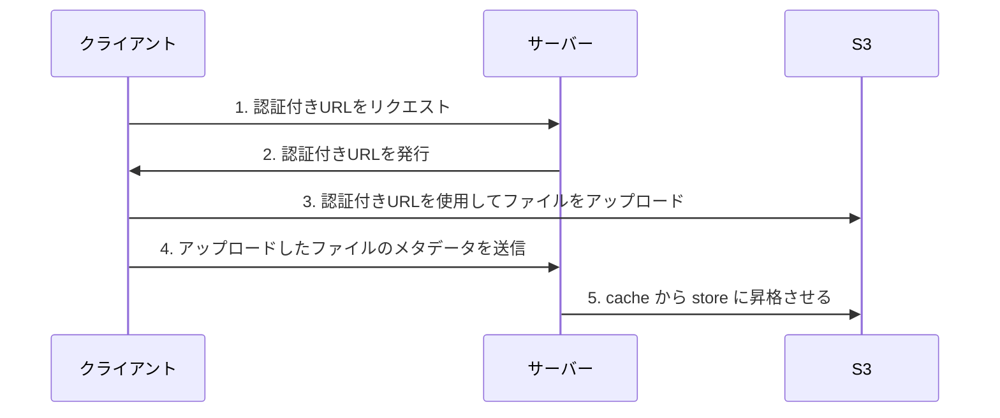

# README
## 認証付きURLによるダイレクトアップロードのシーケンス図


## 実装
### Shrineの認証付きURLの機能を有効にする
```rb
# shrine.rb
Shrine.plugin :presign_endpoint, presign_options: -> (request) {
  # 署名付きURLの有効期限や権限など、必要に応じてオプションを設定
  {
    content_length_range: 0..10 * 1024 * 1024,
    content_disposition: 'attachment',
  }
}
```

### routesの設定
`/s3/params` にアクセスすると認証付きURLを取得できる
```rb
# routes.rb
mount Shrine.presign_endpoint(:cache) => "/s3/params"
```

`presign_endpoint` を使用しない場合は以下のように独自のコントローラーを定義することもできる
```rb
class PresignsController < ApplicationController
  def image
    set_rack_response ArticleUploader.presign_response(:cache, request.env)
  end

  private

  def set_rack_response((status, headers, body))
    self.status = status
    self.headers.merge!(headers)
    self.response_body = body
  end
end
```

### 
