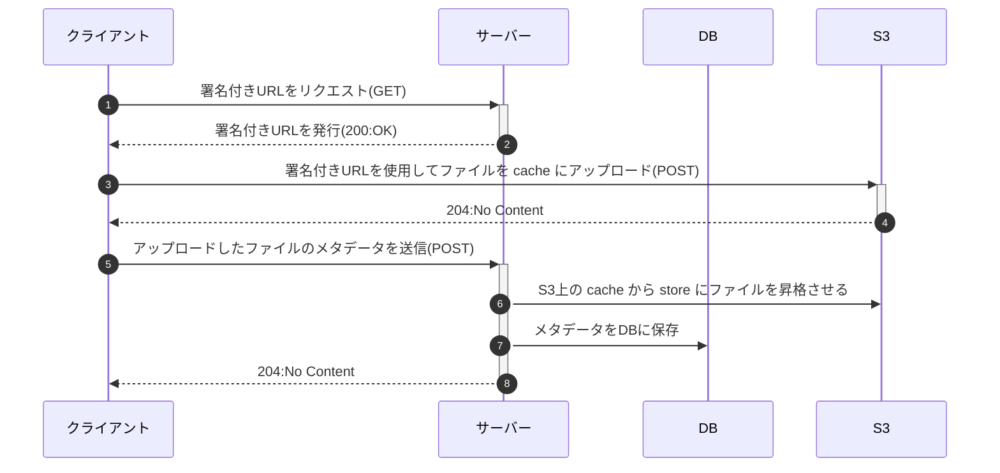

# README
## デモ


## 署名付きURLによるダイレクトアップロードのシーケンス図


## 実装（バックエンド）
### Shrineの署名付きURLの機能を有効にする
```rb
# shrine.rb
Shrine.plugin :presign_endpoint, presign_options: -> (request) {
  {
    # 必要に応じて署名付きURLの有効期限や権限など、必要に応じてオプションを設定
  }
}
```

### routesの設定
`/s3/params` にアクセスすると署名付きURLを取得できる
```rb
# routes.rb
mount Shrine.presign_endpoint(:cache) => "/s3/params"
```

`presign_endpoint` を使用しない場合は以下のように独自のコントローラーを定義することもできる
```rb
# presigns_controller.rb
class PresignsController < ApplicationController
  def image
    set_rack_response ArticleUploader.presign_response(:cache, request.env)
  end

  private

  def set_rack_response((status, headers, body))
    self.status = status
    self.headers.merge!(headers)
    self.response_body = body
  end
end
```

### クライアントからアップロード済みファイルのメタデータを受け取る
```rb
# articles_controller.rb
def create_with_direct_upload
  article_data = params[:article][:article_data]
  article = Article.new(article_data:)
  if article.valid?
    # 必要に応じてファイルの圧縮などの処理を行う
    # この処理を行う場合はファイルはメモリ上に展開されるので、メモリ逼迫に注意
    article.article_attacher.create_derivatives

    # cache から store へ昇格
    article.article_attacher.promote
    article.save
    render json: { message: "Success" }, status: :ok
  else
    render json: { error: article.errors.full_messages.join(", ") }, status: :unprocessable_entity
  end
end
```

## 実装（フロントエンド）
### 署名付きURLを取得
```ts
// FileUpload.tsx
const presignResponse = await axios.get('http://localhost:3001/s3/params', {
  params: {filename: file.name, contentType: file.type},
});
```

```json
// presignResponse
{
  "fields": {
    "key": "cache/xxxxxxxxxxxxxxxxxxxxxxx.png",
    "Content-Disposition": "attachment",
    "policy": "xxxxxxxxxxxxxxxxxxxxxxxxxxxxxxxxxxxxxxxxxxxxxxxxxxxxxxxxxxxxxxxxxxxxxx",
    "x-amz-credential": "XXXXXXXXXXXXXXXXXXXX/20240401/ap-northeast-1/s3/aws4_request",
    "x-amz-algorithm": "XXXX-XXXX-SHA256",
    "x-amz-date": "20240401T070347Z",
    "x-amz-signature": "xxxxxxxxxxxxxxxxxxxxxxxxxxxxxxxxxxxxxxxxxxxxxxxxxxxxxxxxx"
  },
  "headers": {},
  "method": "post",
  "url": "https://xxxxxxxxxxxxxxxxxxxxx.s3.ap-northeast-1.amazonaws.com"
}
```

### 署名付きURLを使ってファイルをアップロード
```ts
// FileUpload.tsx
const uploadResponse = await axios.post(url, formData, {
  headers: {'Content-Type': 'multipart/form-data'},
});
```

### アップロードが完了したらメタデータをサーバーに送信
```ts
// FileUpload.tsx
await axios.post('http://localhost:3001/api/v1/articles/create_with_direct_upload', {
  article: {
    // アップロードしたファイルのキーなど、ファイルに関する情報をJSON文字列として含める
    article_data: JSON.stringify({
      id: id_without_prefix, // S3の署名付きURLで取得したキー
      storage: 'cache', // ファイルが保存されているストレージのタイプ
      metadata: { // ファイルに関するメタデータ
        filename: file.name,
        size: file.size,
        mime_type: file.type
      }
    })
  }
});
```

### その他
- S3 には CORS の設定をする必要がある
  - テナントごとに設定する必要があり大変かも
- ファイルの検証や操作を行わないなら最初からstoreにあげてもいいかも
